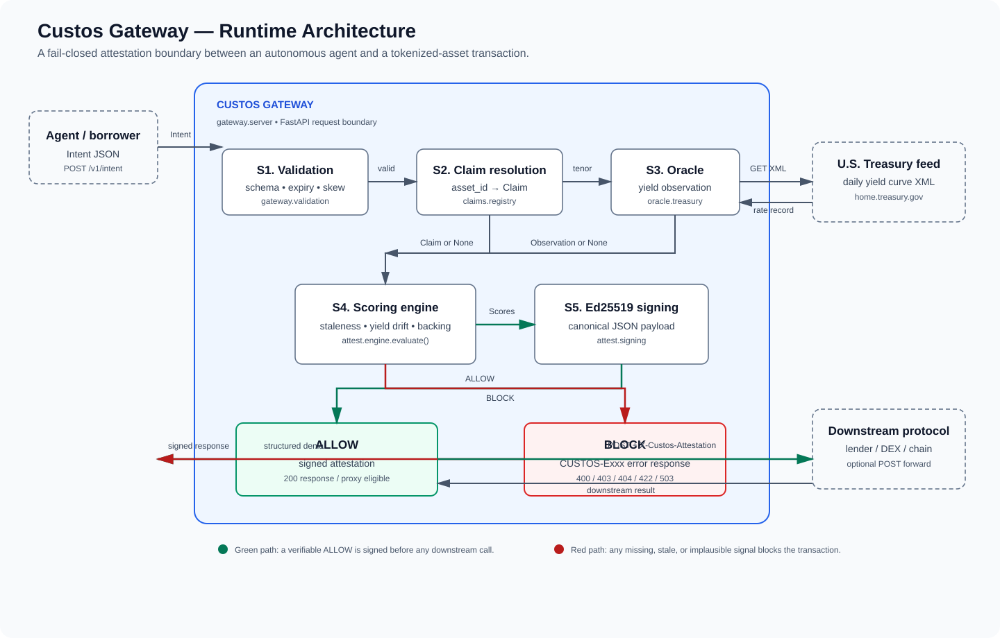
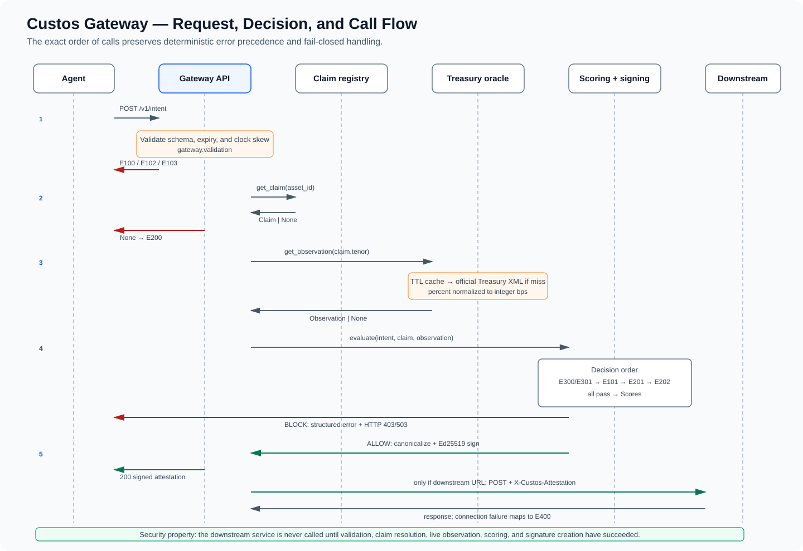

# Custos Gateway — Technical Diagrams

## Runtime architecture

## Request, decision, and call flow

## Endpoint-to-module map

| Endpoint | Primary calls | Result |
|---|---|---|
| `POST /v1/intent` | validation → registry → oracle → engine → signer → optional proxy | Signed ALLOW or structured BLOCK |
| `GET /v1/assets` | registry | Seeded claim records |
| `GET /v1/assets/{asset_id}` | registry → oracle → engine | Read-only claim, observation, and computed evaluation |
| `GET /v1/pubkey` | signer | Current Ed25519 public key in base64 and PEM |
| `GET /v1/health` | oracle | Oracle reachability and the latest available observation |
